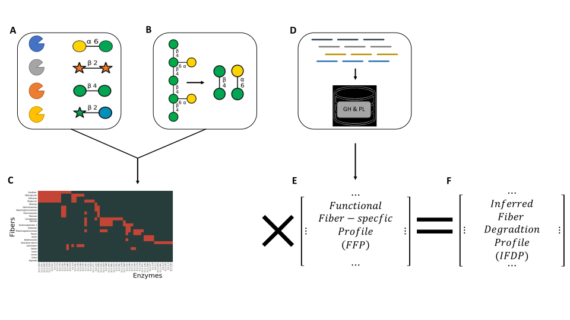

# IFDP



### Requirments:
- diamond (database was built with v0.9.9)
- numpy
- pandas

### Simple one command pipeline:

```./run_sample.sh [DATABASE] [INPUT] [OUTPUT]```

### Outputs:

[OUTPUT] - The diamond mapping output file

[OUTPUT]_counts - The enzyme counts

[OUTPUT]_IFDP - The IFDP profile 
